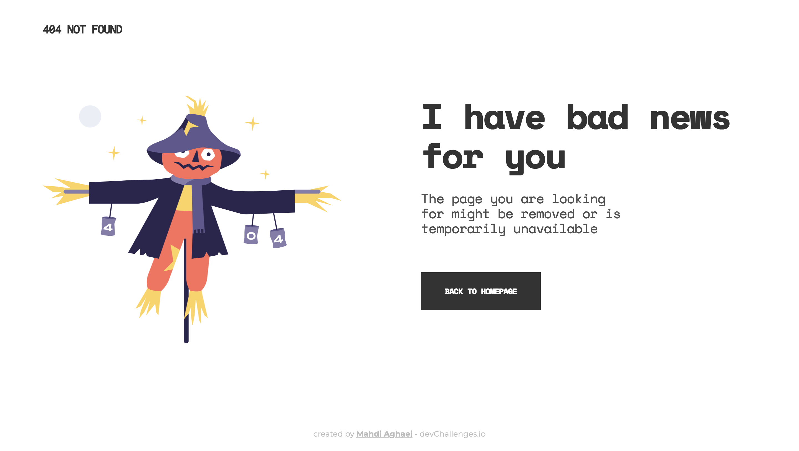

<h1 align="center">404 Page</h1>

   Solution for a challenge from  <a href="http://devchallenges.io" target="_blank">Devchallenges.io</a>.

  <h3>
    <a href="https://mahdi-404page.netlify.app/">
      Solution
    </a>
     | 
    <a href="https://devchallenges.io/challenges/wBunSb7FPrIepJZAg0sY">
      Challenge
    </a>
  </h3>

## Table of Contents

- [Overview](#overview)
  - [Built With](#built-with)
- [Features](#features)
- [Contact](#contact)

## Overview

A simple responsive 404 page challenge from [Dev Challenges](https://devchallenges.io/) website which is a great resource for practicing web develpment.

You can see My solution for [this](https://devchallenges.io/challenges/wBunSb7FPrIepJZAg0sY) particular Challenge, [here](https://mahdi-404page.netlify.app/).

### Built With

- Pure CSS and HTML

## Features

This application/site was created as a submission to a [DevChallenges](https://devchallenges.io/challenges) challenge. The [challenge](https://devchallenges.io/challenges/wBunSb7FPrIepJZAg0sY) was to build an application to complete the given user stories.

## Contact

- Website [mahdi-404page.netlify.app](https://mahdi-404page.netlify.app/)
- GitHub [@MahdiAghaei1](https://github.com/MahdiAghaei1)
- Twitter [@\_mahdiAghaei](https://twitter.com/_mahdiAghaei)
